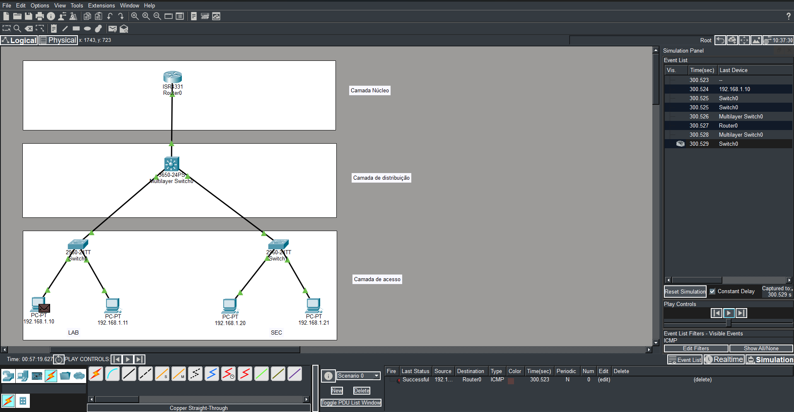

# Laboratório 01 — Rede Hierárquica

## Objetivo

Este laboratório teve como objetivo compreender a organização de uma rede corporativa utilizando o modelo hierárquico de três camadas: **Acesso, Distribuição e Núcleo (Core)**.

A atividade foi desenvolvida no **Cisco Packet Tracer**, envolvendo a montagem da topologia, configuração do endereçamento IP dos dispositivos finais, configuração da interface do roteador e realização de testes de conectividade.

## O que é uma rede hierárquica?

Uma **rede hierárquica** é uma forma de organizar a infraestrutura de uma rede em diferentes camadas, cada uma com funções específicas. A rede é dividida em três camadas: **Acesso, Distribuição e Núcleo (Core)**.

Essa organização é especialmente útil em redes maiores, pois permite dividir uma infraestrutura complexa em partes menores e mais fáceis de **gerenciar, configurar, expandir e solucionar problemas**. Em vez de tratar toda a rede como uma única estrutura, a divisão em camadas permite que cada parte desempenhe uma função específica e facilita a administração da infraestrutura.

A **camada de Acesso** é responsável pela conexão dos dispositivos finais, como computadores, à rede. A **camada de Distribuição** controla e gerencia o tipo e a quantidade de tráfego que flui entre a camada de Acesso e a camada de Núcleo. Já a **camada de Núcleo (Core)** funciona como o principal caminho de comunicação entre diferentes partes da infraestrutura, priorizando uma comunicação eficiente entre os dispositivos de rede.

Dessa forma, a utilização de uma arquitetura hierárquica torna a rede mais **organizada, escalável e gerenciável**, facilitando seu crescimento e a manutenção da infraestrutura.

## Topologia da rede

- **1 roteador Cisco 4331** — Camada de Núcleo
- **1 switch multilayer Cisco 3650-24PS** — Camada de Distribuição
- **2 switches Cisco 2960-24TT** — Camada de Acesso
- **4 PCs**

## Conexões

Foram utilizados cabos **Straight-Through (cabo direto)** para realizar as conexões entre os dispositivos.

## Endereçamento IP

Os computadores foram configurados com endereços IP pertencentes à rede `192.168.1.0/24`.

| Dispositivo        | Endereço IP  |
| ------------------ | ------------ |
| PC-Lab01           | 192.168.1.10 |
| PC-Lab02           | 192.168.1.11 |
| PC-Sec01           | 192.168.1.20 |
| PC-Sec02           | 192.168.1.21 |
| Roteador-Core-4331 | 192.168.1.1  |

**Máscara de sub-rede:** `255.255.255.0`

**Gateway padrão:** `192.168.1.1`

## Configuração do roteador

A interface GigabitEthernet 0/0/0 do roteador foi configurada com o endereço `192.168.1.1/24` e ativada utilizando a CLI:

```text
enable
configure terminal
interface gigabitEthernet 0/0/0
ip address 192.168.1.1 255.255.255.0
no shutdown
exit
```

## Testes de conectividade

Após a configuração dos dispositivos, foram realizados testes utilizando o comando `ping`.

No PC-Lab01, foi realizado um teste de comunicação com o PC-Sec01:

```text
ping 192.168.1.20
```

Também foi realizado um teste de comunicação entre o PC-Lab01 e o roteador:

```text
ping 192.168.1.1
```

Os testes foram utilizados para verificar a conectividade entre os dispositivos da rede.

## Simulação ICMP

Além dos testes utilizando o `ping`, foi utilizada a ferramenta **Simulation** do Cisco Packet Tracer para visualizar o caminho percorrido pelo pacote ICMP.

O filtro de eventos foi configurado para exibir somente pacotes **ICMP**, permitindo observar o tráfego partindo do PC-Lab01 e chegando ao Roteador-Core-4331.

A simulação permitiu visualizar o percurso do pacote através das camadas:

**Acesso → Distribuição → Núcleo**

## Resultado



A topologia acima representa a arquitetura hierárquica implementada no laboratório, com as camadas de Acesso, Distribuição e Núcleo.

A simulação também apresentou o envio do pacote ICMP com sucesso até o roteador.
